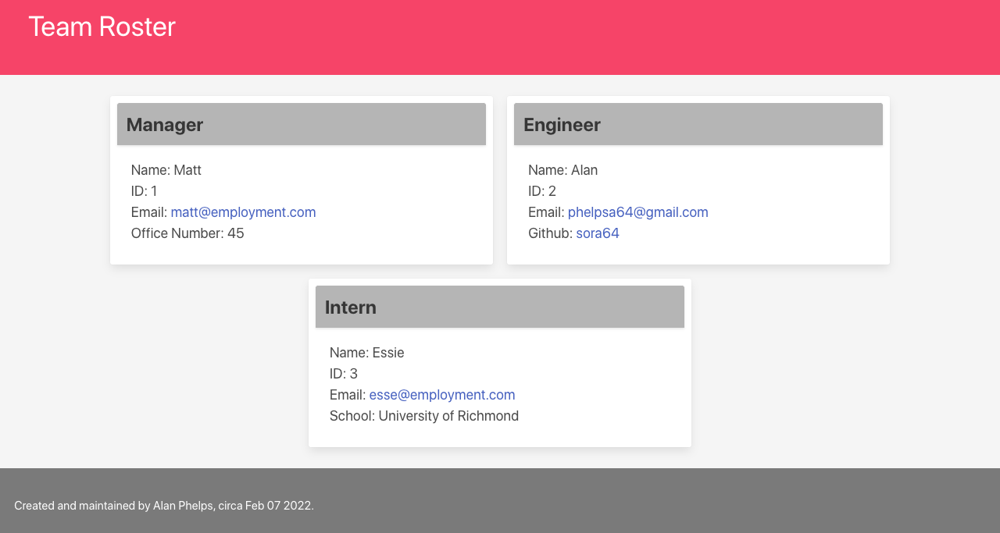

  # phelps-team-profile-generator-challenge

  

  ## Description

  This application allows an employer to input information for up to six employees which is then displayed on a webpage. This application was created via node.js and is run from the terminal.

  ## Table of Contents

  - [Installation](#installation)
  - [Usage](#usage)
  
  
  - [Tests](#tests)
    
  - [Questions](#questions)

  - [Screenshot](#screenshot)
  

  ## Installation

  Make sure to install the required packages with "npm install" before running the application.

  ## Usage

  Start the application by opening an integrated terminal at the directory level of index.js, then by entering "node index" into that terminal. Answer the prompts as they appear. After you have gone through the prompts, an index.html file will be added in the "dist" folder. Open that file in your browser, and enjoy your new webpage!

  ## Tests
  This application uses jest for testing the creation of various objects via parent and child classes.
    

  ## Questions

  - GitHub: [sora64](https://github.com/sora64/)

  - Email: If you have any other questions, please reach me at [phelpsa64@gmail.com](mailto:phelpsa64@gmail.com).

  ## Screenshot

  